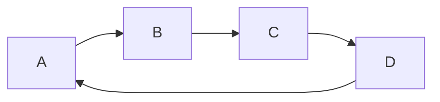

# homeassitant-mermaid-card

A custom card to support mermaidjs (https://mermaid-js.github.io/)



## Installation

### Manual install

1. Download and copy `mermaidjs-card.js`into your `config/www` directory.

2. Add the resource reference as decribed below.

### Add resource reference

If you configure Lovelace via YAML, add a reference to `apexcharts-card.js` inside your `configuration.yaml`:

```yaml
resources:
  - url: /local/mermaidjs-card.js?v=0.0.1
    type: module
```

Else, if you prefer the graphical editor, use the menu to add the resource:

1. Make sure, advanced mode is enabled in your user profile (click on your user name to get there)
2. Navigate to Configuration -> Lovelace Dashboards -> Resources Tab. Hit orange (+) icon
3. Enter URL `/local/mermaidjs-card.js` and select type "JavaScript Module".
4. Restart Home Assistant.
